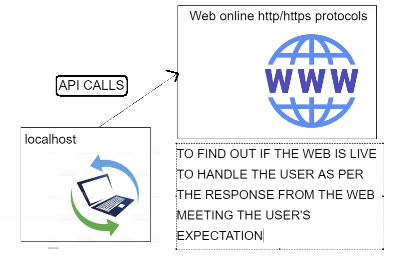

# Python Modules
**Python Libraries and built-in functions** 
```python
# Few ways to import modules
# Not good to import * as it congests the namespace
# Aliasing is a good idea if the module name is very long (e.g. datetime -> dt)
import <mod name>
import <mod name> as <alternate name>
from <mod name> import <name>
from <mod name> import *
```
```python
# We used datetime, os, sys
# You can import multiple modules in one line
import datetime, os, sys
```
**What is pip?**
- A package manager and installer
```python
# Syntax to install packages -- use in terminal
pip install <name>
```


**Task 1**
```python
# This will round a number appropriately
def round_task():
    choice = input("Input a number to check: ")
    if not choice.isdigit():
        round_task() 
    checker = float(choice) % 1
    if checker >= 0.5:
        return print(math.ceil(float(choice)))
    else:
        return print(math.floor(float(choice)))
```


**API's**



