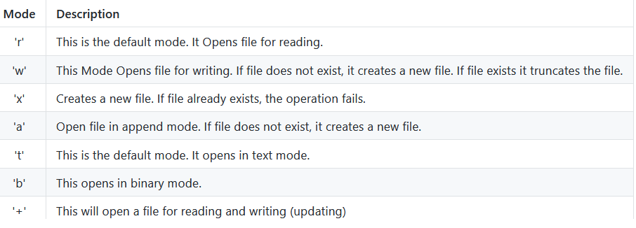

# Python Modules
**Python Libraries and built-in functions** 
```python
# Few ways to import modules
# Not good to import * as it congests the namespace
# Aliasing is a good idea if the module name is very long (e.g. datetime -> dt)
import <mod name>
import <mod name> as <alternate name>
from <mod name> import <name>
from <mod name> import *
```
```python
# We used datetime, os, sys
# You can import multiple modules in one line
import datetime, os, sys
```
**What is pip?**
- A package manager and installer
- Use ```pip install <name>``` to install python modules


**Task 1**
```python
# This will round a number appropriately
def round_task():
    choice = input("Input a number to check: ")
    if not choice.isdigit():
        round_task() 
    checker = float(choice) % 1
    if checker >= 0.5:
        return print(math.ceil(float(choice)))
    else:
        return print(math.floor(float(choice)))
```


**API's**


- Apply CRUD - Create, Read, Update, Delete

```python
import requests
from emoji import emojize

# Receives the status code from the website
response = requests.get("https://www.bbc.co.uk/")

# 200 = live -- 404 = error, not found

# first iteration
if response.status_code == 200:
    print("Up and running")
elif response.status_code == 404:
    print("Unavailable")
else:
    print("Oops, something went wrong!")

#second iteration
# If status code is between 200-400 the .status_code returns True
# Otherwise, the boolean is False
def check_response_code(response):
    if response.status_code == requests.codes.ok:
        print("Up and running")
    elif response.status_code == requests.codes.not_found:
        print("Unavailable")
    else:
        print("Oops, something went wrong!")
```

**Json Basic**
- Stands for Javascript Object Notation
- Data is in key-value pairs
- Use cases:
    - Browser data
    - Json encoding from a dictionary
    - Json decoding into a dictionary
    - Handling files
    - Writing to files
    - Reading from files

```python
# This creates a car dictionary and parses it into a .json file called
# "car_data.json"
import json

car_data = {
    "Name": "Tesla",
    "Engine": "Electric",
}

with open("car_data.json", "w") as jsonfile:
    # indent=4 makes it look clearer
    # sort_keys=True will sort the keys alphabetically/numerically
    #'
    json.dump(car_data, jsonfile, indent=4, sort_keys=True)
```

```python
# When added to above, this will pull data from a .json file#
# In this example, the .json file is called car_data.json
# which is the file created above
# json.load(<name>) will then make it a dictionary in python
with open("car_data.json", "r") as jsonfile:
    car = json.load(jsonfile)
    print(type(car))
    print(car["name"])
```



**Exception handling**
- This involves some keywords like: ```try```, ```except```, ```raise```, ```else```

```python
# This will try the code first, if a FileNotFoundError is called then
# the 'except:' code is called
try:
    file = open("orders.txt")
except FileNotFoundError:    
    print("File not found")
```

- Using them all:

```python
# This is the code block for try except
try:
    file = open("orders.txt")
except FileNotFoundError:    
    print("File not found")
    # If we wanted them to see the actual exception then use raise
    raise   

# finally will execute regardless of the above conditions
finally:
    print("Thanks!")
```